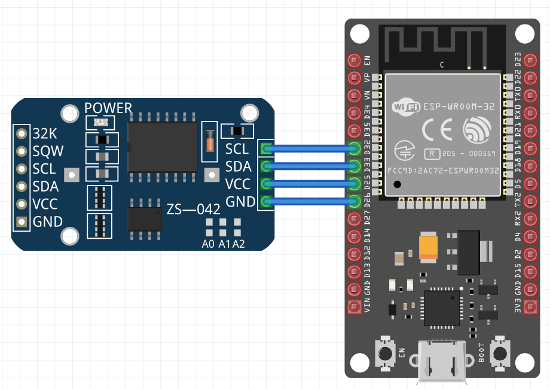

# DS3231 driver for tasmota ESP32x, written in the Berry scripting language.



## Notice
The tasmota system has support for DS3231, but only on custom builds. This driver offers this functionality for stock Tasmota esp32x images.

## Characteristics
- It is tested and working with ESP32 ESP32-S2 and ESP32-C3.
- ESP8266 is not working, it cannot run Berry. You can build a custom tasmota image for this case.
- Only time get and time set (No alarms or other DS3231 chip features).
- The blue breakout found on online stores, also contains an EEPROM chip which is not handled here.
- The code is event driven (as it should in berry). The ESP is free to do all usual tasmota tasks and can also run other berry code.

## Driver Installation
Tasmota Web Interface -> tools -> Berry Scripting Console

Paste and execeute this code

```berry
do
  var fn = 'ds3231.be'
  var cl = webclient()
  var url = 'https://raw.githubusercontent.com/pkarsy/TasmotaBerryTime/refs/heads/main/ds3231/' + fn
  cl.begin(url)
  if cl.GET() != 200 print('Error getting', fn) return end
  var s = cl.get_string()
  cl.close()
  var f = open('/'+fn, 'w')
  f.write(s)
  f.close()
  print('Installed', fn)
end
```
Or upload the "ds3231.be" to the tasmota filesystem

# Conecting the DS3231 breakout

We need 4 pins : **GND VCC SDA SCL** These pins are populated on both sides of the board, use the most convenient.

Now we have to configure Tasmota to use those pins .
```
TasmotaMain -> Configuration -> Module
```
For the maximum convenience we can set them to have the same order as in the DS3231 board.

For ESP32 devkit as shown in the schematic above :
```sh
GPIO 26 -> OutputLow (acts as GND) Do not cascade more devices, only DS3231
GPIO 25 -> OutputHi (acts as VCC) only DS3231
GPIO 33 -> I2C SDA
GPIO 32 -> I2C SCL
# OK it is wasteful on GPIO pins but makes the connection easy.
# If you want to cascade more I2C devices, use normal GND and VCC
```

Now we test the module. Go to Berry scripting console and type
```sh
load('ds3231')
```
You will see a message hopefully reporting success.

## Automatically load the driver at startup

Tasmota Web Interface -> Tools -> Manage Filesystem -> Edit "autoexec.be" (The white icon with the pencil)

Or create a new file with this name

At the top of the file (to get the time as soon as possible) add the line:
```sh
load('ds3231')
```
This way we can have the time before(if) the WIFI is up, and before the other berry modules are loaded.

## Blue Breakout coin cell selection

For 3.3V boards (and ESP32 is 3.3V), if a LIR2032 is installed, you have to remove it and install a good quility CR2032 (Not LIR !). Even if a CR2032 is installed, better use a new one.  More details at the end of the page.

## Unreliable power
If your power source is unreliable
```
SetOption65 1
```
in tasmota console, to avoid unexplained resets to factory defaults. Battery power can easily lead to this problem. Read the documentation however before setting this option.

## How the driver works
The DS3231 has 7 registers containing (year, month, day, etc) At boot the driver reads all those registers and assembles the "epoch" time and sets the system time. When(if) the internet becomes available the oposite operation is done.
I don't know if the native tasmota DS3231 code does it, but this module updates the RTC clock periodically (on every NTP update, about every hour). This way the RTC clock remains always accurate, unless of course the ESP is without internet connection for extended periods of time.

## Limitations
Although very accurate(2ppm), the DS3231 can be off by 1min per year. If the module is going to be used standalone (without internet) and you need better accuracy, you might consider using a GNSS module(No time drift, ever). The tasmota system have support for UBLOX modules (again a custom build is needed). This repository contains also "gnsstime" which serves the same purpose as ds3231 and does not require a custom build.

## Optional topics

### More details about the blue DS3231 breakout
The most popular (on online stores) breakout, has a weird design choice. In particular it has a primitive charging circuitry (a diode and a resistor in series) and is trying to charge a rechargeable coin cell (LIR2032). Most of the time however the breakout is sold with a normal (CR2032) or no battery at all. The use of a rechargeable battery is problematic:

- The LIR2032 is no nearly as common, and it is more expensive than CR2032.
- It has a very low capacity and higher shelf discharge rate than CR2032.
- With ESP(or any other 3.3V MCU) VCC=3.3V and the LIR2032 cannot be charged.
- It seems the chemistry of LIR does not allow for deep discharge, so it is destroyed if fully discharged(not sure about this). With 3.3V the cell will be always discharged and the time will be lost on every power outage.
- According to online sources, voltages more than 4.7 V can potentially damage the coin cell. This does not affect 3.3 boards.

For the above reasons use the very common CR2032 cell. It can last 10 years (according to data sheets).

### 5V MCUS
If you are using 5V for the VCC(Arduino UNO for example, no ESP32, not this driver), [disable the charging circuit](https://duckduckgo.com/?q=ds3231+disable+charging&t=lm&iar=images&iax=images&ia=images), to avoid damaging the non rechargeable CR2032 cell. Of course it does not hurt to desolder the diode on 3.3V boards(ESP32 STM32 etc) , but it is not necessary.

Finally, do not trust the coin cell (if came) with the module, use a new one.