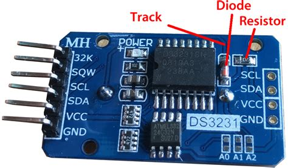

# DS3231 berry driver for tasmota

## Purpose

The tasmota system already contains support for DS3231, but only on custom builds. This driver offers this functionality for stock esp32xx images. If your node needs a custom image anyway or if you
use esp8266 (Berry cannot run there), use the builtin feature.

## Characteristics

- Does not try to implement all the features of DS3231, only time get and time set (No alarms or other DS3231 chip features)
- The breakout found on online stores also contains an EEPROM chip which is not handled here
- The code is event driven (as it should in berry). The ESP is free to do all usual tasmota tasks and can run other berry code.
- *probably* works with DS3232 (not tested)

## Installation
- paste this to Berry Scripting Console
```berry
do
  var fn = 'ds3231.be'
  var cl = webclient()
  var url = 'https://raw.githubusercontent.com/pkarsy/TasmotaBerryTime/refs/heads/main/ds3231/' + fn
  cl.begin(url)
  if cl.GET() != 200 print('Error getting', fn) return end
  var s = cl.get_string()
  cl.close()
  var f = open('/'+fn, 'w')
  f.write(s)
  f.close()
  print('Installed', fn)
end
```
Or upload the "ds3231.be" to the tasmota filesystem
- In the PIN configuration, choose the most convenient PINs for you project as SDA and SCL. For example, the Luatos Esp32-c3 lite can be configured with 

```sh
SCL->GPIO4
SDA->GPIO5
```

so the pins are in the same order as ds3231 (including 3.3V and GND), and can be directly connected, or even soldered to the ESP module.

- If your power source is unreliable

    > SetOption65 1

    to avoid unexplained resets to factory defaults. Battery power can easily lead to this problem. Read the documentation however before setting this option.

- Connect a spare GND from your ESP board to the DS3231. Connect a 3.3V output pin(NOT 5V)
 of the board to DS3231
- Go to berry scripting console and type

    > load('ds3231')

    You will see a message reporting success(or failure)
- If all is OK put this in "autoexec.be"
- If you have other berry files to load/import put it first, so the system time will be OK when the other files are loaded.

## Breakout battery problem



The most popular (on online stores) breakout, has a weird design choice. In particular it has a primitive charging circuitry (a diode and a resistor in series) and is trying to charge a rechargeable battery (LIR2032). Most of the time however the breakout is sold with a normal (CR2032) or no battery at all. The use of a rechargeable battery is a somewhat problematic choice anyway :

- The LIR2032 is no nearly as common, and it is more expensive than CR2032.
- It has a very low capacity and higher shelf discharge rate than CR2032.
- With ESP(or any other 3.3V MCU) we want the DS3231-VCC to be 3.3V and the LIR2032 cannot be charged with this voltage.
- It seems the chemistry of LIR does not allow for deep discharge, so it is destroyed if fully discharged. Not sure about this.

For the above reasons use the very common CR2032. It can last 10 years according to data sheets. To avoid damaging the non rechargeable CR2032 cell, you must de-solder the diode (or the resistor).

Finally, do not trust the coin cell (if came) with the module, use a new one.

## How the driver works

The DS3231 has 7 registers containing year month etc. At boot the module reads all those registers and assembles the "epoch" time and sets the system time. When(if) the internet becomes available the opposite operation is done.
I don't know if the native tasmota DS3231 code does it, but this module updates the RTC clock periodically (on every NTP update, about every hour). This way the RTC clock remains always accurate, unless of course the ESP is without internet connection for extended periods of time.

## Limitations

Although very accurate(2ppm), the DS3231 can be off by 1min per year. If the module is going to be used standalone (without internet) and you need such accuracy, you might consider using a GNSS module. The tasmota system have support for UBLOX modules (again a custom build is needed). This repository contains also "gnsstime" which serves the same purpose as ds3231 and does not require a custom build.
